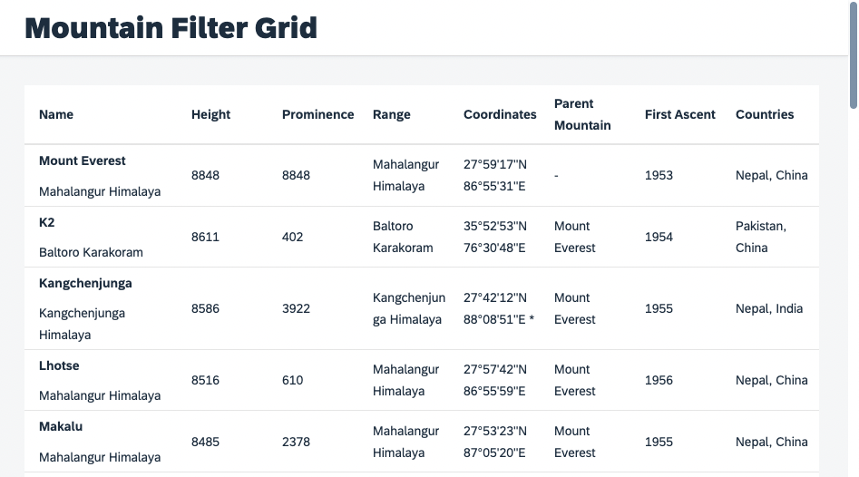

# Exercise 1 - Setup

To get started, you need to ensure that you have a recent git and Node.js version 12 or higher installed on your machine. To follow the tutorial it is also recommended to have knowledge in UI5 application or control development. There are great resources available to learn and explore, such as the [UI5 Walkthrough](https://sapui5.hana.ondemand.com/#/entity/sap.m.tutorial.walkthrough).

## Start the Application

Clone our tutorial repository and switch to the corresponding folder:

```sh
git clone https://github.com/bendkt/ui5con2022-p13n-ws.git
cd ui5con2022-p13n-ws
```

Install the npm dependencies and start the application:

```sh
npm install
npm start
```

Now open a new browser tab on [http://localhost:8080/index.html](http://localhost:8080/index.html). Make yourself familiar with the application and feel free to explore the corresponding resources in the `webapp` folder of the repository. This is our starting point.



The application is displaying the data of the world's highest mountains in a table. You can see their names, height, year of first ascent and more. Because there is a lot of info at once and maybe more than users need, it might be desirable for them to personalize their experience.

The goal is to enrich the application with features like sorting, grouping and filtering. It should be easy to answer questions such as: In which year happened the first ascent to Mt. Everest? Or: Which are the ten highest mountains in the world?

We want you to achieve this through the following objectives:
- Create a custom table control with dialogs for column selection, sorting etc.
- Add a `sap.f.GridList` as filter option for the table
- Include and connect a `sap.ui.fl.variants.VariantManagement` for persistency


>**Remark:** In case you got stuck an any point of the tutorial, you can go to the [exercises folder](https://github.com/bendkt/ui5con2022-p13n-ws/tree/main/exercises) and copy the content of the previous exercises' solution folder into the webapp folder and continue from there. 

## Summary

Great! Now that you have prepared the development setup let us start to enhance the application.
Continue to - [Exercise 2](../ex02/)
