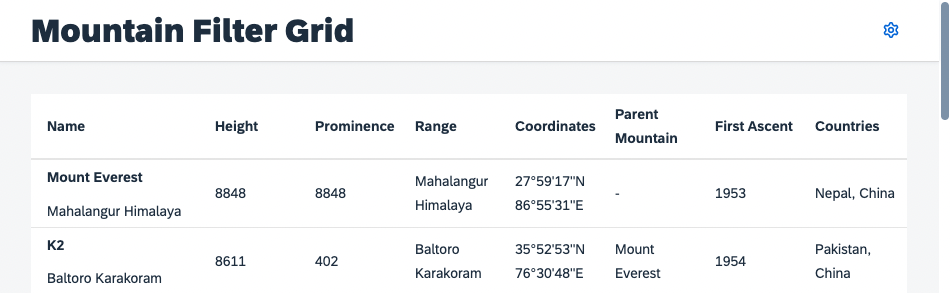
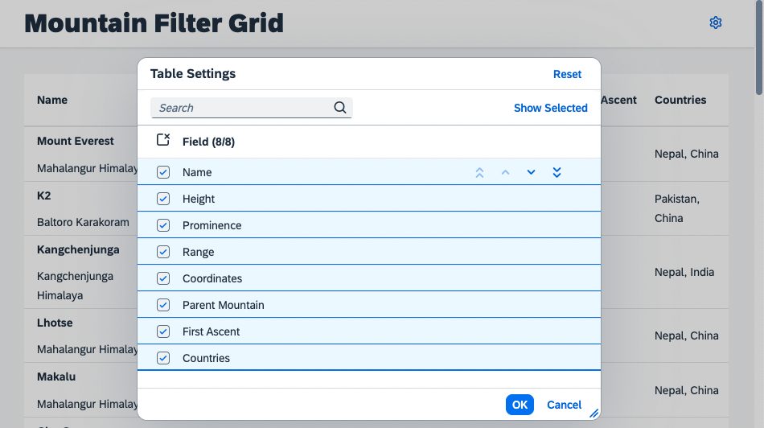

# Engine Registration for Table
Having established the custom control, you can start adding personalization capabilities by making use of the `sap.m.p13n.Engine`. 
## Load the Dependencies
Require the dependencies in `P13nTable.js`. Add the following modules and their imports:

````js
sap.ui.define([
    "sap/m/Table",
    "sap/m/p13n/Engine",
    "sap/m/p13n/SelectionController",
    "sap/m/p13n/MetadataHelper",
    "sap/m/p13n/modification/ModificationHandler"
], function (
    Table, Engine, SelectionController, MetadataHelper, ModificationHandler
) {
    "use strict";
````
## Required Modules
* [`sap.m.p13n.Engine`](https://openui5nightly.hana.ondemand.com/api/sap.m.p13n.Engine): The central artifact and API for application/control development. Since the Engine is a static artifact, you need to ensure that control instances are registered to it.
* [`sap.m.p13n.SelectionController`](https://openui5nightly.hana.ondemand.com/api/sap.m.p13n.SelectionController): A basic controller that allows to manage the state of control aggregations. It detects changes like adding, removing and reordering the aggregation's items. It also provides the UI for personalization.
* [`sap.m.p13n.MetadataHelper`](https://openui5nightly.hana.ondemand.com/api/sap.m.p13n.MetadataHelper): Serves as an interface to fetch required metadata for the Controller, so that the dialog and the according selection can be performed properly.
* [`sap.m.p13n.modification.*ModificationHandler`](https://openui5nightly.hana.ondemand.com/api/sap.m.p13n.modification.ModificationHandler): Defines the persistency that is used by the Engine to store personalization changes.

## Register the Table
Register the `P13nTable` to the `Engine`. Pass the control instance, the metadata provided via the helper, and the desired controllers. As the binding path should be part of the metadata you have to register to `updateFinished` event of the `P13nTable`. This way it is ensured that certain binding related information is available when needed.

````js
var P13nTable = Table.extend("ui5con.p13nApp.control.P13nTable", {
    constructor: function () {
        Table.apply(this, arguments);

        //on updateFinished p13n can be initialized, the Promise is stored for later
        this._pInitialized = new Promise(function(resolve, reject){
            this.attachEventOnce("updateFinished", function() {
                this._initP13n();
                resolve();
            }, this);
        }.bind(this));
    },
    renderer: "sap.m.TableRenderer"
});
````

As next step add the `_initP13n` function to the `P13nTable`. This method should only be called once to initialize the personalization by registering the `Table` instance to the `Engine` using [`Engine#register`](https://openui5nightly.hana.ondemand.com/api/sap.m.p13n.Engine#methods/register). The `SelectionController` should manage the visibility and order of columns. 

So that the `Engine` can work with the metadata, there is a `MetadataHelper` that supports you in providing the metadata in the required format and serves as an interface between `Engine` and your service metadata.

>**Note**: The metadata passed to the helper needs to be *serializable*, as it might be stored in a persistence later. Furthermore you should not add *personal* or *protected* information, as it could be retrieved by anyone with access to the persistency. 

The metadata should contain the following properties:
- `key`: Used to identify the according item and by default associated with the corresponding control ID.
- `label`: Displayed in personalization popups to display the corresponding item.

The `path` is optional and contains the binding path for later usage.  Very likely the metadata for your application is available in a different format, so this is just an example of how it can be done. You might need to do it differently in your productive scenario:

````js
P13nTable.prototype._initP13n = function () {
    var aColumnsMetadata = [];

    this.getColumns().forEach(function (oColumn, iIndex) {
        aColumnsMetadata.push({
            key: oColumn.getId(),
            label: oColumn.getHeader().getText(), 
            path: this.getItems()[0].getCells()[iIndex].getBinding("text").getPath()
        });
    }.bind(this))

    this.oHelper = new MetadataHelper(aColumnsMetadata)

    Engine.register(this, {
        helper: this.oHelper,
        modification: new ModificationHandler(),
        controller: {
            Columns: new SelectionController({
                control: this,
                targetAggregation: "columns"
            })
        }
    });
};
````

The `Engine#register` retrieves an object with configuration parameters as second argument:
- `helper`: The helper defines which metadata is available, for example to allow displaying it in personalization Popups (e.g. the label).
- `modification`: Defines the desired persistency, which is for now the standard handler that does not persist any data. This implementation gets changed later in the workshop.
- `controller`: The registry of controllers with an arbitrary name `Columns` for the `SelectionController` instance. The name is up to the developer.

>**Note**: The `columns` aggregation of the table is now managed by the `SelectionController`. This means there should be *no alteration* of the  `columns` aggregation via the usual API (e.g. `addColumn`, `removeColumn`...) as this would lead to conflicts with the internal mechanisms. Only that way the Engine can act as central management for state and persistence. 

## Open a Personalization Popup

The personalization dialog needs to be opened with via [`Engine#show`](https://openui5nightly.hana.ondemand.com/api/sap.m.p13n.Engine#methods/show). It requires passing the relevant parameters. Those are the registered Control, the required personalization panel and some configuration for the dialog to be displayed properly. To do that, add a function to the reusable `P13nTable` control:

````js
P13nTable.prototype.openP13n = function (oEvent) {
    Engine.show(this, ["Columns"], {
        title: "Table Settings",
        source: oEvent.getSource()
    });
};
````

In this method call, the `Engine` opens a popup for the controller registered for key `Columns` earlier in the registration process. In addition, you can pass a custom title for the dialog and the button as source of the event.

Next, add a button in the `Mountains.view.xml` file as trigger. Also add a method `onP13nPress` in the `Mountains.controller.js` file:

````xml
<mvc:View
    height="100%"
    displayBlock="true"
    xmlns:mvc="sap.ui.core.mvc"
    xmlns="sap.m"
    xmlns:f="sap.f"
    xmlns:core="sap.ui.core"
    xmlns:ctl="ui5con.p13nApp.control"
    controllerName="ui5con.p13nApp.controller.Mountains">

	<f:DynamicPage id="dynamicPageId">
		<f:title>
			<f:DynamicPageTitle>
				<f:heading>
					<Title text="Mountain Filter Grid"/>
				</f:heading>

				<f:actions>
                    <Button id="p13nButton" icon="sap-icon://action-settings" type="Transparent" press=".onP13nPress"/>
				</f:actions>

			</f:DynamicPageTitle>
		</f:title>

````

The application now has a settings icon in the upper right corner of the page.



Last but not least, add the according controller code to trigger the execution of the `P13nTable#openP13n` method in the `Mountains.controller.js` file: 

````js
onP13nPress: function(oEvent) {
    this.byId("table").openP13n(oEvent);
}
````

Once this step has been completed, you can press the settings icon and see that the `Engine` displays the personalization Popup with the labels defined durning the registration process using the `MetadataHelper`.



As you might have noticed, the selection state is already maintained properly by using the `SelectionController`. But since you did not yet implement any handling for the selections in the UI, the table does not change its columns visibility and ordering yet.

## Summary
You got to know the required modules for enhancing your table with personalization features. You registered it to the according controller, so that now a UI comes up. [Exercise 4](../ex04/) shows, how to add the relevant handling for the columns selection.

