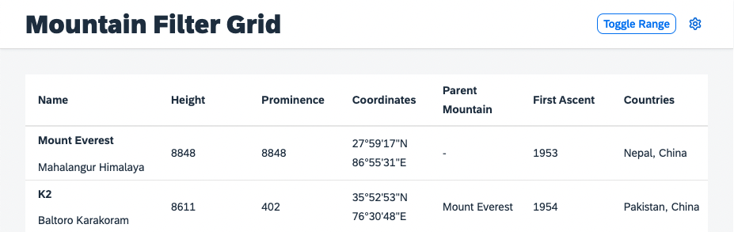

# Change the Control State
Although it might not be the most prominent scenario for your application, there could be a need to change a personalization enabled control's state programmatically. As mentioned before, it is not possible to do this with the control's standard API for aggregation management. 

## Using the Engine State API
The `Engine` comes with two methods that allow for state alteration of managed aggregations, with promise return values. 
* [`Engine#retrieveState`](https://openui5nightly.hana.ondemand.com/api/sap.m.p13n.Engine#methods/retrieveState): Allows you to retrieve the current state of a control and modify it.
* [`Engine#applyState`](https://openui5nightly.hana.ondemand.com/api/sap.m.p13n.Engine#methods/applyState): Allows you to provide a state with modifications that can be applied to the target control.

Usually you would use those two API as a couple. Retrieving the state in the current format and place your instructions in a declarative manner. That way the `Engine` can process the desired changes. First create the two methods, in case you would like to expose them as part of your custom `P13nTable`. You might not need to do that, but for learning purposes let us assume you do.

````js
P13nTable.prototype.applyState = function(oState) {
    return this._pInitialized.then(function(){
        return Engine.applyState(this, oState);
    }.bind(this))
};

P13nTable.prototype.retrieveState = function() {
    return this._pInitialized.then(function(){
        return Engine.retrieveState(this);
    }.bind(this))
};
````

Create a toggle button in the `Mountains.view.xml`:
````xml
<mvc:View
    height="100%"
    displayBlock="true"
    xmlns:mvc="sap.ui.core.mvc"
    xmlns="sap.m"
    xmlns:f="sap.f"
    xmlns:core="sap.ui.core"
    xmlns:ctl="ui5con.p13nApp.control"
    controllerName="ui5con.p13nApp.controller.Mountains">

	<f:DynamicPage id="dynamicPageId">
		<f:title>
			<f:DynamicPageTitle>
				<f:heading>
					<Title text="Mountain Filter Grid"/>
				</f:heading>

				<f:actions>
                    <ToggleButton id="toggleRangeButton" text="Toggle Range" press=".onToggleRange" type="Transparent"/>
                    <Button id="p13nButton" icon="sap-icon://action-settings" type="Transparent" press=".onP13nPress"/>
				</f:actions>

			</f:DynamicPageTitle>
		</f:title>
````
Next you are going to use the state API to toggle the visibility of a column and move it to the first position. For this, we can use the newly created API of the `P13nTable` as follows. 

>**Note**: As explained earlier, the object retrieved from the state API contains the current state. To change this the modifications need to be *added*. For example, if you want to hide a column from the current state, you explicitly need to set the visibility flag to false. If you want to move a column, you need to provide the position.


Ensure that the `MessageToast` module is required in the `Mountains.controller.js` file.
````js
sap.ui.define([
    "sap/ui/core/mvc/Controller",
    "sap/ui/model/json/JSONModel",
    "sap/m/MessageToast"
],
    /**
     * @param {typeof sap.ui.core.mvc.Controller} Controller
     */
    function (Controller, JSONModel, MessageToast) {
        "use strict";

````

Add the following method to the `Mountains.controller.js`

````js
onToggleRange: function(oEvent) {
    var oTable = this.byId("table");
    var bPressed = oEvent.getSource().getPressed();
    oTable.retrieveState().then(function(oState) {
        var oRangeColumn = oState.Columns.find(function(oColumn) {
            return oColumn.key == RANGE_ID;
        });
        if (bPressed && oRangeColumn) {
            oRangeColumn.visible = false;
            MessageToast.show("Range hidden");
        } else {
            oState.Columns.push({key: RANGE_ID, position: 0});
            MessageToast.show("Range shown");
        }
        oTable.applyState(oState);
    });
}
````

In addition define the static key that we want to toggle:
````js
//...

    var RANGE_ID = 'container-ui5con.p13nApp---Mountains--range';

    return Controller.extend("ui5con.p13nApp.controller.Mountains", {

        //...
````

Once these steps have been implemented, you can now toggle the `Range` column using the `Engine` state APIs.



This becomes handy once we start to handle the persistency of the personalization functionality, which are explained in a later step of this tutorial.

## Summary
You have learned how to modify the state of a Control using the `Engine` and its state API. You have understood, that the state passed from `retrieveState` is the current state of the control that can be altered with instructions of what should change and passed to `applyState`. Go on with [Exercise 7](../ex07/).