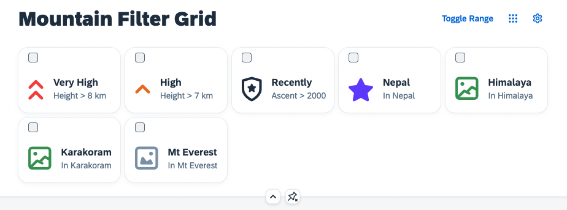
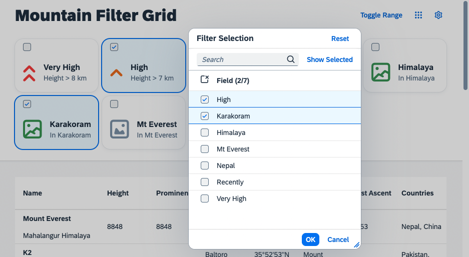

# Grid Filter Control
A very usual thing to do when working with tables is the demand to look for items of certain properties. Naturally you would like to filter the list for those. This is what you are going to implement in this exercise.

>**Remark**: As we introduced in the beginning, the `Engine` is currently still in the *experimental* phase. In parallel to doing the last refinements, the development team is also working on an integrated filter controller and panel. For now we are going to show, how filtering can be achieved with existing means of the `Engine`.

## The filter metadata
Have a look at the `filters` file:

````json
{ "filters": [
    {
        "label": "Very High",
        "description": "Height > 8 km",
        "expression": [
            "height",
            "GT",
            8000
        ],
        "icon": "sap-icon://collapse-group",
        "color": "Negative"
    },
    {
        "label": "High",
        "description": "Height > 7 km",
        "expression": [
            "height",
            "GT",
            7000
        ],
        "icon": "sap-icon://navigation-up-arrow",
        "color": "Critical"
    }

    // ...

]}
````

There are labels, descriptions and filter expressions already predefined and maintained in the `filterModel` of the application. Add the `GridList` control as dependency and add it to the `DynamicPageHeader`. Bind it to the filter model as shown:

````xml
<f:DynamicPageHeader pinnable="true">
    <f:GridList
        id="gridFilter"
        items="{filters>/filters}"
        mode="MultiSelect"
        includeItemInSelection="true"
        selectionChange=".onGridFilterSelect">
        <f:GridListItem type="Active">
            <HBox class="sapUiSmallMarginTopBottom">
                <core:Icon
                    src="{filters>icon}"
                    color="{filters>color}"
                    size="2.5rem"
                    class="sapUiSmallMarginBeginEnd"/>
                <VBox class="sapUiSmallMarginEnd">
                    <Title text="{filters>label}"/>
                    <Label text="{filters>description}"/>
                </VBox>
            </HBox>
        </f:GridListItem>
    </f:GridList>
</f:DynamicPageHeader>
````
The application should look like this now:




You may have noticed, that this control offers a multi selection functionality, but does not yet include any handling for selecting the different grid tiles. You can use the selection of this list, to create filter expressions for the table in the next steps.

## GridList Engine registration

Similar to before, register the `GridList` to the `Engine` so that it can benefit from personalization related functionality. Only that this time you implement a different interpretation of the state handling result to demonstrate the capabilites and use cases of the `Engine`. Add the following module dependencies in the `Mountains.controller.js` file:

````js
sap.ui.define([
    "sap/ui/core/mvc/Controller",
    "sap/m/p13n/Engine",
    "sap/m/p13n/modification/ModificationHandler",
    "sap/m/p13n/SelectionController",
    "sap/m/p13n/MetadataHelper",
    "sap/ui/model/json/JSONModel",
    "sap/ui/model/Filter",
    "sap/m/Text",
    "sap/m/Label",
    "sap/m/MessageToast"
],
    /**
     * @param {typeof sap.ui.core.mvc.Controller} Controller
     */
    function (Controller, Engine, ModificationHandler, SelectionController, Helper, JSONModel, Filter, Text, Label, MessageToast) {
        "use strict";
````

Initialize the grid filter by implementing a `_initGridFilter` method:

````js
onInit: function () {
    this._initGridFilter();
},

_initGridFilter: function() {
    var oGridFilter = this.byId("gridFilter");
    var oFilterModel = oGridFilter.getModel("filters");

    var aFilterMetadata = [];
    oGridFilter.getItems().forEach(function (oItem, i) {
        aFilterMetadata.push({
            key: oItem.getId(),
            label: oFilterModel.getData().filters[i].label,
            expression: oFilterModel.getData().filters[i].expression
        });
    });

    var oFilterHelper = new Helper(aFilterMetadata);

    Engine.register(oGridFilter, {
        modification: new ModificationHandler(),
        helper: oFilterHelper,
        controller: {
            Items: new SelectionController({
                control: oGridFilter,
                targetAggregation: "items",
                selector: function(oProperty) {
                    return sap.ui.getCore().byId(oProperty.key).getSelected();
                }
            })
        }
    });
    
    Engine.attachStateChange(this._onP13nStateChange.bind(this));
},
````

And add the new `_onP13nStateChange` method:
````js
_onP13nStateChange: function(oEvt){
    var oState = oEvt.getParameter("state");
    var oGridFilter = this.byId("gridFilter");
        
    if(oEvt.getParameter("control") === oGridFilter) {

        oGridFilter.getItems().forEach(function(oItem){
            oItem.setSelected(!!oState.Items.find(function(oStateItem) {
                return oItem.getId() === oStateItem.key;
            }));
        });
    }
},
````

The grid filter is now ready for personalization using the `Engine`. This time, a different state handling was implemented. Note that `Items` is the registered name for our `SelectionController`. This time use the selection state to create filters for the table. Use the `Engine#show` method to open the selection dialog:

````js
onGridFilterPress: function(oEvt) {
    Engine.show(this.byId("gridFilter"), ["Items"], {
        title: "Filter Selection",
        source: oEvt.getSource()
    });
},

````

Attach the according event handler through a new button in the `Mountains.view.xml`:
````xml
<mvc:View
    height="100%"
    displayBlock="true"
    xmlns:mvc="sap.ui.core.mvc"
    xmlns="sap.m"
    xmlns:f="sap.f"
    xmlns:core="sap.ui.core"
    xmlns:ctl="ui5con.p13nApp.control"
    controllerName="ui5con.p13nApp.controller.Mountains">

	<f:DynamicPage id="dynamicPageId">
		<f:title>
			<f:DynamicPageTitle>
				<f:heading>
					<Title text="Mountain Filter Grid"/>
				</f:heading>

				<f:actions>
                    <ToggleButton id="toggleRangeButton" text="Toggle Range" press=".onToggleRange" type="Transparent"/>
                    <Button id="gridFilterButton" icon="sap-icon://grid" type="Transparent" press=".onGridFilterPress"/>
                    <Button id="p13nButton" icon="sap-icon://action-settings" type="Transparent" press=".onP13nPress"/>
                </f:actions>

			</f:DynamicPageTitle>
		</f:title>
````

Restart the application and observe an additional button in the upper right corner, which opens a selection dialog. This time not to toggle the visibility of columns but to toggle the selection status of the items in the `GridList` and to create filter objects accordingly.


## Summary
We now have a nice Grid List control, that should serve as a Filter for the table. In the next step you will learn how to enable filtering via the `Engine` Selection Controller. Continue with [Exercise 8](../ex08/).