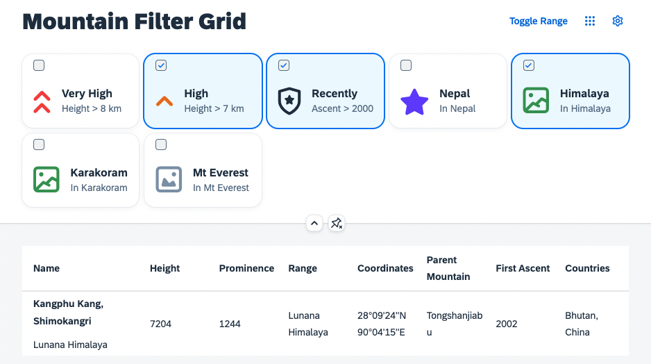

# Filter via Selection Controller
This exercise shows how to introduce some static filters and how their selection can be made part of the personalization and managed by the `SelectionController`. Furthermore the grid list should be enabled to react on tile clicks by using the `Engine` state API.
## Create Filters on State Change
Update the binding by adding the filters that can be created from the filter model. 
````js
_onP13nStateChange: function(oEvt){
    var oState = oEvt.getParameter("state");
    var oGridFilter = this.byId("gridFilter");
        
    if(oEvt.getParameter("control") === oGridFilter) {

        oGridFilter.getItems().forEach(function(oItem){
            oItem.setSelected(!!oState.Items.find(function(oStateItem) {
                return oItem.getId() === oStateItem.key;
            }));
        });

        var aFilters = [], sFilter;
        oState.Items.forEach(function(oStateItem) {
            var oItemContext = sap.ui.getCore().byId(oStateItem.key).getBindingContext("filters");
            var aParts = oItemContext.getProperty("expression");
            aFilters.push(new Filter(aParts[0], aParts[1], aParts[2]));
        }.bind(this));

        this.byId("table").getBinding("items").filter(aFilters);
    }
},
````
And change the selector of the controller registration, to respect the actual filter state:
````js
Engine.register(oGridFilter, {
    modification: new ModificationHandler(),
    helper: oFilterHelper,
    controller: {
        Items: new SelectionController({
            control: oGridFilter,
            targetAggregation: "items",
            selector: function(oProperty) {
                return !!this.byId("table").getBinding("items").aFilters.find(function(oFilter){
                    var oMetaData = oFilterHelper.getProperty(oProperty.key);
                    return oFilter.getPath() === oMetaData.expression[0] && oFilter.getValue1() === oMetaData.expression[2];
                });
            }.bind(this)
        })
    }
});
````
## Enable the Grid List Selection
At this point you might have noticed, that the clicks on the tiles of the grid list do not work as expected. That is because their status change is not yet recognized by the `Engine`. As explained earlier, a direct modification of the aggregation might lead to inconsistencies. Add an event handler for the grid list selection:
````js
onGridFilterSelect: function(oEvent) {
    var oGridFilter = this.byId("gridFilter");
    var oItem = oEvent.getParameter("listItem");
    Engine.retrieveState(oGridFilter).then(function(oState) {
        var sItemId = oItem.getId()

        var oStateItem = oState.Items.find(function(oStateItem) {
            return oStateItem.key == sItemId
        });

        if (oItem.getSelected()) {
            oState.Items.push({key: sItemId});
        } else {
            oStateItem.visible = false;
        }

        Engine.applyState(oGridFilter, oState)
    });
},

````
In `Mountains.view.xml` you can attach the event handler, so that it is called on the `selectionChange` event of the `GridList` control:

````xml
 <f:GridList
    id="gridFilter"
    items="{filters>/filters}"
    mode="MultiSelect"
    includeItemInSelection="true"
    selectionChange=".onGridFilterSelect">
    <f:GridListItem type="Active">
        <HBox class="sapUiSmallMarginTopBottom">
            <core:Icon
                src="{filters>icon}"
                color="{filters>color}"
                size="2.5rem"
                class="sapUiSmallMarginBeginEnd"/>
            <VBox class="sapUiSmallMarginEnd">
                <Title text="{filters>label}"/>
                <Label text="{filters>description}"/>
            </VBox>
        </HBox>
    </f:GridListItem>
</f:GridList>
````

Now you can try filtering of the table. The result set should only show, what you defined via the grid filter:



## Summary
You have learned how to apply a filter with the Grid List that is integrated with the `Engine`. You should be able to see, how the table is being filtered in the running application. Unfortunately you cannot see the active filters, when the header is collapsed, right? Let us change that in [Exercise 9](../ex09/).