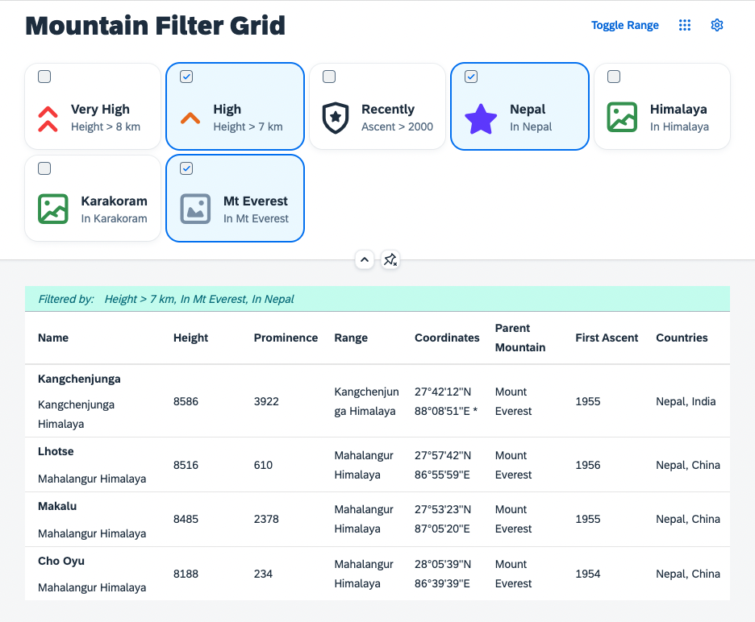
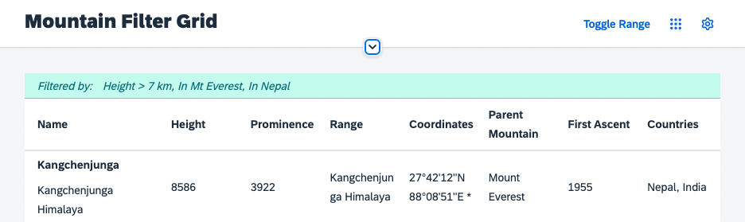

# Infobar for Table Filters
Being able to set filters on the table, it might be helfpul for users to actually have an overview of which filters are applied. In this exercise an info toolbar is added to the Table.

## Add a filter message to the Table
Currently there is no visual indicator for the user that the table has been filtered except for the selection of the `GridList`. To improve this, add a message stating the current filters the user applied to the table. Therefore add a new method to the `Mountains.controller.js`:

````js
 _setFilterInfoText(sFilter) {
    var oTbl = this.byId("table");
    var oInfoToolbar = oTbl.getInfoToolbar()
    if (sFilter && !oInfoToolbar) {
        oTbl.setInfoToolbar(new sap.m.OverflowToolbar({
            design: "Info",
            active: true,
            content: [
                new Text({ text: "Filtered by:" }),
                new Label({ text: sFilter })
            ]
        }));
    } else if (sFilter) {
        oInfoToolbar.getContent()[1].setText(sFilter);
    } else {
        oTbl.getInfoToolbar() && oTbl.getInfoToolbar().destroy();
    }
}
````

This method accepts a string as parameter and adds it to the table's info toolbar. The string should be constructed out of the data the filters model provides. Enhance the grid filter specific state handling in the `Mountains.controller.js` file to call the method as follows:

````js
_onP13nStateChange: function(oEvt){
    var oState = oEvt.getParameter("state");
    var oGridFilter = this.byId("gridFilter");
        
    if(oEvt.getParameter("control") === oGridFilter) {

        oGridFilter.getItems().forEach(function(oItem){
            oItem.setSelected(!!oState.Items.find(function(oStateItem) {
                return oItem.getId() === oStateItem.key;
            }));
        });

        var aFilters = [], sFilter;
        oState.Items.forEach(function(oStateItem) {
            var oItemContext = sap.ui.getCore().byId(oStateItem.key).getBindingContext("filters");
            var aParts = oItemContext.getProperty("expression");
            var sLabel = oItemContext.getProperty("description");
            aFilters.push(new Filter(aParts[0], aParts[1], aParts[2]));
            sFilter = sFilter ? sFilter + ", " + sLabel : sLabel;
        }.bind(this));

        this.byId("table").getBinding("items").filter(aFilters);
        this._setFilterInfoText(sFilter);
    }
}
````

Now try to select some filters. The filter state is now shown in the table and is properly updated whenever you change the selection in the dialog:



Even when the header is collapsed, the user can see them:



## Summary
Having a good visualization for the filter state, there are a few more improvements you can make. Follow up on that in [Exercise 10](../ex10/).

