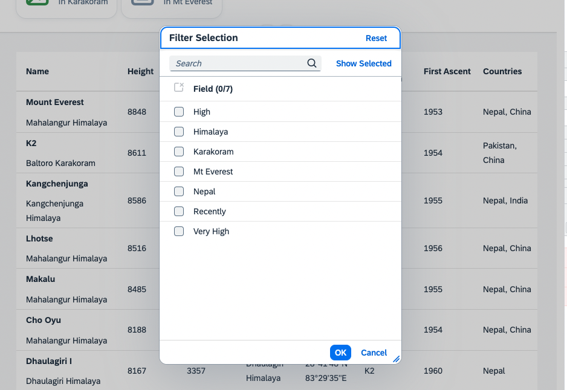
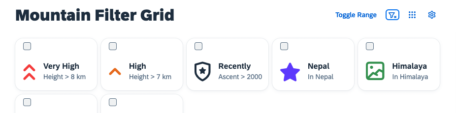

# Dialog Customization and Clear Filters
As there is a nice set of features available in the application, let us improve the user experience now. In this exercise you are going to customize the personalization dialog with appropriate names and in terms of size. Furthermore you can learn how to enhance the table, so that applied filters are transparent to the user at all times.

## Dialog Customization
You can set, for example, an appropriate title, so that users can understand, what they can do when the dialog is open. You can also add some custom height and width in the `Mountains.controller.js` method `onGridFilterPress`:

````js
onGridFilterPress: function(oEvt) {
    Engine.show(this.byId("gridFilter"), ["Items"], {
        title: "Filter Selection",
        contentWidth: "25rem",
        contentHeight: "30rem",
        source: oEvt.getSource()
    });
}
````

See the results:



## Clear Filter Button
Since you already learned how to make use of the `Engine` state APIs, why not add a clear filter button to the application, to make it easier for the user to remove the filters for the table to see all entries again.
Therefore, add another button to the `Mountains.view.xml`:

````xml
<mvc:View
    height="100%"
    displayBlock="true"
    xmlns:mvc="sap.ui.core.mvc"
    xmlns="sap.m"
    xmlns:f="sap.f"
    xmlns:core="sap.ui.core"
    xmlns:ctl="ui5con.p13nApp.control"
    controllerName="ui5con.p13nApp.controller.Mountains">

	<f:DynamicPage id="dynamicPageId">
		<f:title>
			<f:DynamicPageTitle>
				<f:heading>
					<Title text="Mountain Filter Grid"/>
				</f:heading>

				<f:actions>
                    <ToggleButton id="toggleRangeButton" text="Toggle Range" press=".onToggleRange" type="Transparent"/>
                    <Button id="clearFilterButton" icon="sap-icon://clear-filter" type="Transparent" press=".onClearFilterPress"/>
                    <Button id="gridFilterButton" icon="sap-icon://grid" type="Transparent" press=".onGridFilterPress"/>
                    <Button id="p13nButton" icon="sap-icon://action-settings" type="Transparent" press=".onP13nPress"/>
                </f:actions>

			</f:DynamicPageTitle>
		</f:title>
````

And add the according method `onClearFilterPress` to the `Mountains.controller.js`:

````js
onClearFilterPress: function() {
    this.byId("gridFilter").removeSelections();
    var oGridFilter = this.byId("gridFilter");
    Engine.retrieveState(oGridFilter).then(function(oState) {
        oState.Items.forEach(function(oStateItem) {
            oStateItem.visible = false;
        });

        Engine.applyState(oGridFilter, oState);
    });

    this._setFilterInfoText();
}
````

If you now check the application again, you might see the clear filter Button in the upper right corner. 



Try adding some filters through the grid filter control. Clearing them using the newly added button should remove the filters and clear the info toolbar of the table.
## Summary
Completing the application with a nice user experience, by customizing the dialogs and showing the applied filters for the table leaves us with one open question. How can all the personalized settings be persisted? Please follow up on that in [Exercise 11](../ex11/).