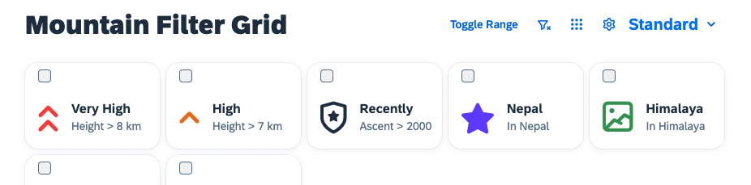
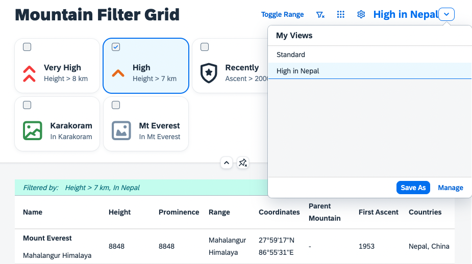

# VariantManagement
In case you wondered, how the personalization settings are persisted, so that users can come back to their favorite presets at a later point in time, this exercise provides the answer. You can integrate the `sap.ui.fl.variants.VariantManagement` into the application. If you want to know more what a Variant Management can do, please see the [official documentation](https://experience.sap.com/fiori-design-web/variant-management/).
# Include the VariantManagement
To be able to run the `VariantManagement` you need to include the required dependency to the `sap.ui.fl` library and add the variant management to the view. The variant management also needs a reference to the controls, that should be managed. You can find further details about the enablement of your application with SAPUI5 flexibility [here](https://sapui5.hana.ondemand.com/#/topic/f1430c0337534d469da3a56307ff76af) - this description will guide you through necessary prerequisites.
````xml
<mvc:View
    height="100%"
    displayBlock="true"
    xmlns:mvc="sap.ui.core.mvc"
    xmlns="sap.m"
    xmlns:f="sap.f"
    xmlns:core="sap.ui.core"
    xmlns:sap.ui.fl="sap.ui.fl"
    xmlns:vm="sap.ui.fl.variants"
    xmlns:ctl="ui5con.p13nApp.control"
    controllerName="ui5con.p13nApp.controller.Mountains">

	<f:DynamicPage id="dynamicPageId">
		<f:title>
			<f:DynamicPageTitle>
				<f:heading>
					<Title text="Mountain Filter Grid"/>
				</f:heading>

				<f:actions>
                    <ToggleButton id="toggleRangeButton" text="Toggle Range" press=".onToggleRange" type="Transparent"/>
                    <Button id="clearFilterButton" icon="sap-icon://clear-filter" type="Transparent" press=".onClearFilterPress"/>
                    <Button id="gridFilterButton" icon="sap-icon://grid" type="Transparent" press=".onGridFilterPress"/>
                    <Button id="p13nButton" icon="sap-icon://action-settings" type="Transparent" press=".onP13nPress"/>
                     <vm:VariantManagement id="myVM" for="table,gridFilter"/>
                </f:actions>
               
			</f:DynamicPageTitle>
		</f:title>
````

Once the `VariantManagement` control has been added, you can it in the upper right corner of the application next to the buttons:



The personalization changes are not yet persisted in the `VariantManagement`. Change some further settings to achieve that. Additionally the `Engine`'s own Flex handlers need to be registered. No worries, you do not need to implement them yourself, you can just add them instance specifically in the view by providing `sap.ui.fl:flexibility="sap/m/flexibility/EngineFlex"` as additional attribute:

````xml
<f:GridList
    id="gridFilter"
    sap.ui.fl:flexibility="sap/m/flexibility/EngineFlex" 
    items="{filters>/filters}"
    mode="MultiSelect"
    includeItemInSelection="true"
    selectionChange=".onGridFilterSelect">
````

````xml
<ctl:P13nTable id="table"
    sap.ui.fl:flexibility="sap/m/flexibility/EngineFlex" 
    inset="false"
    items="{mountains>/mountains}">
````
# Change the Modification Handler
Last but not least, change the modification handler to the real `FlexModificationHandler`. That way all processed changes are actual flexibility changes that can be persisted in the official SAPUI5 flexibility service. Please find more information on how to get SAPUI5 flexibility in the [official documentation](https://help.sap.com/docs/UI5_FLEXIBILITY_KEY_USER/0f8b49c4dfc94bc0bda25a19aa93d5b2/365187a3cb1b4579a910532aa3c48ba2.html).

`Mountains.controller.js#_initGridFilter`
````js
_initGridFilter: function() {
    var oGridFilter = this.byId("gridFilter");
    var oFilterModel = oGridFilter.getModel("filters");

    var aFilterMetadata = [];
    oGridFilter.getItems().forEach(function (oItem, i) {
        aFilterMetadata.push({
            key: oItem.getId(),
            label: oFilterModel.getData().filters[i].label,
            expression: oFilterModel.getData().filters[i].expression
        });
    });

    var oFilterHelper = new Helper(aFilterMetadata);
    
    Engine.register(oGridFilter, {
        modification: new FlexModificationHandler(),
        helper: oFilterHelper,
        controller: {
            Items: new SelectionController({
                control: oGridFilter,
                targetAggregation: "items",
                selector: function(oProperty) {
                    return !!this.byId("table").getBinding("items").aFilters.find(function(oFilter){
                        var oMetaData = oFilterHelper.getProperty(oProperty.key);
                        return oFilter.getPath() === oMetaData.expression[0] && oFilter.getValue1() === oMetaData.expression[2];
                    });
                }.bind(this)
            })
        }
    });
    
    Engine.attachStateChange(this._onP13nStateChange.bind(this));
},
````

Also ensure to change the dependency:
````js
sap.ui.define([
    "sap/ui/core/mvc/Controller",
    "sap/m/p13n/Engine",
    "sap/m/p13n/modification/FlexModificationHandler",
    "sap/m/p13n/SelectionController",
    "sap/m/p13n/MetadataHelper",
    "sap/ui/model/json/JSONModel",
    "sap/ui/model/Filter",
    "sap/m/Text",
    "sap/m/Label",
    "sap/m/MessageToast"
],
    /**
     * @param {typeof sap.ui.core.mvc.Controller} Controller
     */
    function (Controller, Engine, FlexModificationHandler, SelectionController, Helper, JSONModel, Filter, Text, Label, MessageToast) {
        "use strict";
````


Adapt the persistence handling of the `P13nTable#_initP13n` and change the modification handler to the `FlexModificationHandler`:
````js
P13nTable.prototype._initP13n = function () {
    var aColumnsMetadata = [];

    this.getColumns().forEach(function (oColumn, iIndex) {
        aColumnsMetadata.push({
            key: oColumn.getId(),
            label: oColumn.getHeader().getText(), 
            path: this.getItems()[0].getCells()[iIndex].getBinding("text").getPath()
        });
    }.bind(this))

    this.oHelper = new MetadataHelper(aColumnsMetadata)

    Engine.register(this, {
        helper: this.oHelper,
        modification: new FlexModificationHandler(),
        controller: {
            Columns: new SelectionController({
                control: this,
                targetAggregation: "columns"
            }),
            Sorter: new SortController({
                control: this
            }),
            Groups: new GroupController({
                control: this
            })
        }
    });

    Engine.attachStateChange(function (oEvt) {
        if (oEvt.getParameter("control") === this) {
            this.onStateChange(oEvt.getParameter("state"));
        }
    }.bind(this));
};
````

Also here, don`t forget to change the dependency:
````js
sap.ui.define([
    "sap/m/Table",
    "sap/m/p13n/Engine",
    "sap/m/p13n/SelectionController",
    "sap/m/p13n/SortController",
    "sap/m/p13n/GroupController",
    "sap/m/p13n/MetadataHelper",
    "sap/m/p13n/modification/FlexModificationHandler",
    "sap/ui/model/Sorter"
], function (
    Table, Engine, SelectionController, SortController, GroupController, MetadataHelper, FlexModificationHandler, Sorter
) {
    "use strict";
````

Now give it a try and see that all of the personalization options that have been enabled through this workshop are now persisted using the `VariantManagement`, as soon as you create or save them as new new view.



## Summary
This was the last exercise of the workshop, we hope you enjoyed it and are happy with the provided know how and functionality. In the final state of the application you can see, that by using the `Engine` approach you are spared a lot of the coding you would have to provide to create an own persistency. The `Engine` approach manages the integration into SAPUI5 flexibility, provides the personalization UI accordinng to the latest UX guidelines via a comparably easy to use interface. Please let us know your feedback or ideas regarding how we could make this even more usable in the future.